一、插件化开发——事件监听与模块扩展

1. 使用插件化开发模式创建一个插件，保证插件能够正常加载（ctp.log中搜索插件id可找到记录）（4 分）

   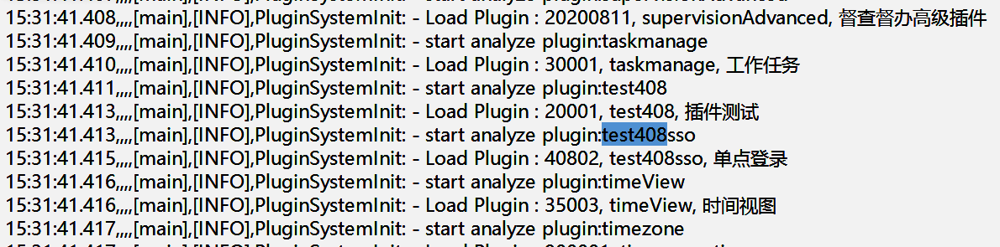

2. 在项目中添加事件监听组件，编写代码实现：

   - 监听组织模型的人员创建事件（AddMemberEvent），获取被创建人员的姓名和部门信息，调用系统的消息接口给创建人发送欢迎入职的消息（userMessageManager.sendSystemMessage）（3 分）
   - 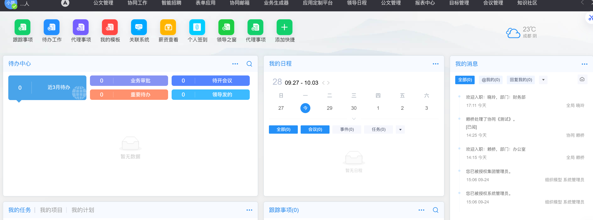
   - 监听流程结束后事件，记录流程 ID 和审批完成时间、流程标题到ctp.log日志中（CtpLogFactory.getLog）（3 分）

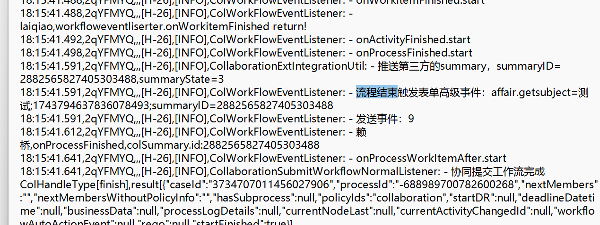

二、REST 接口——部门人员查询与 Token 调用（15 分）

1. 按照 V5 REST 接口规范（包名 `com.seeyon.ctp.rest.resources`，继承 BaseResource），编写部门人员查询接口：

   - 使用 GET 或 POST 方法，返回 JSON 格式数据（6 分）

     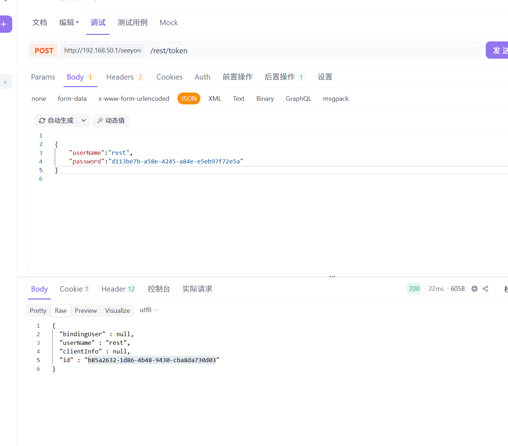

2. 编写客户端调用代码，实现：

   - 通过部门ID（org_unit表中type=Department）查询部门成员（orgManager.getMembersByDepartment），接口返回部门下成员的：人员ID、人员姓名、人员登录名、所在单位名称、所在部门名称、主岗岗位名称、职务名称（5 分）
   - 使用Postman或Apifox等工具成功调用接口（2 分）

3. 接口定义必须满足：只使用 GET / POST，新增/修改/删除/查询操作使用对应动作词（create/update/remove/query）（2 分)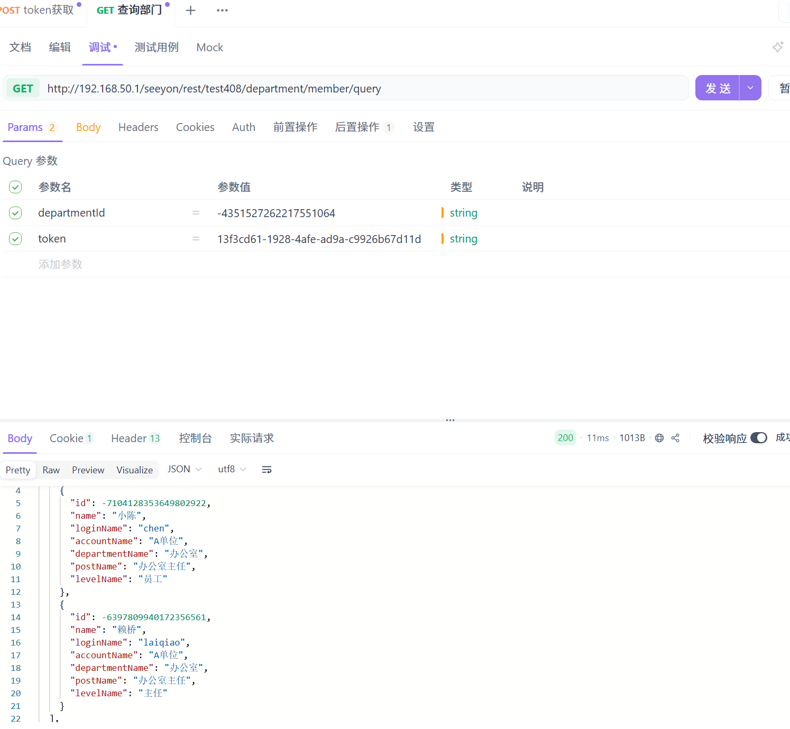

三、单点登录——Ticket 模式 SSO 实现

1. 按照V5插件化开发规范，定义单点登录插件，插件能够正常加载（ctp.log中搜索插件id可找到记录）（2 分）

   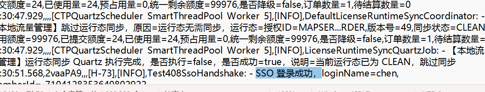

2. 编写 SSO 验证接口（继承SSOLoginHandshakeAbstract，重写handshake）的核心代码，实现：

   - 解析 ticket 获取用户标识：ticket 需传递加密后的用户登录名，在handshake中解密ticket获取用户登录名（4 分）

   - 通过组织模型 API 查找用户（orgManager.getMemberByLoginName）（4 分）

     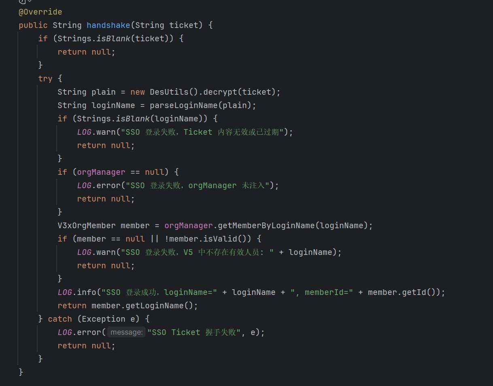

3. 补充必要的 Spring 配置和握手类代码，自己使用 SSO 接口成功登录 OA 首页，并能跳转到"协同BPM门户"页面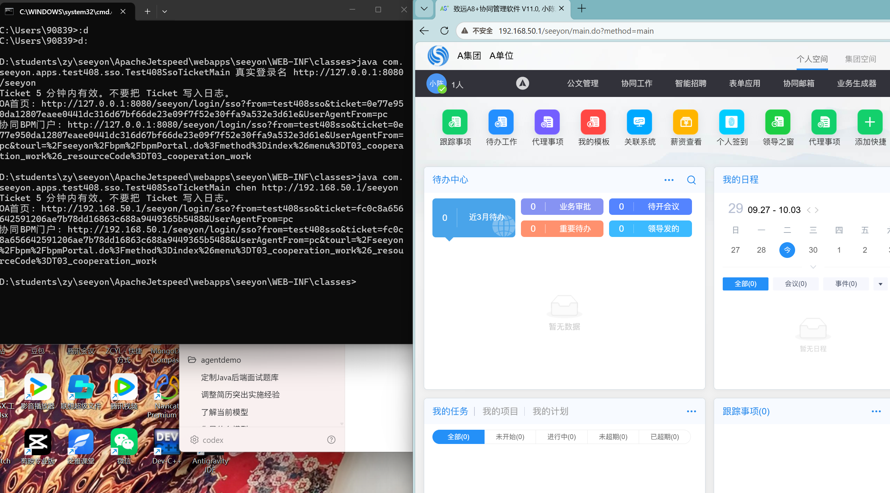

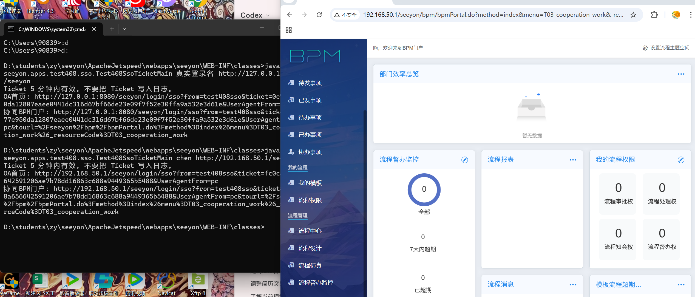

四、自定义登录认证——第三方认证登录（10 分）

1. 设计第三方认证登录的认证流程，并画出时序图（或文字描述关键步骤）。（2 分）

   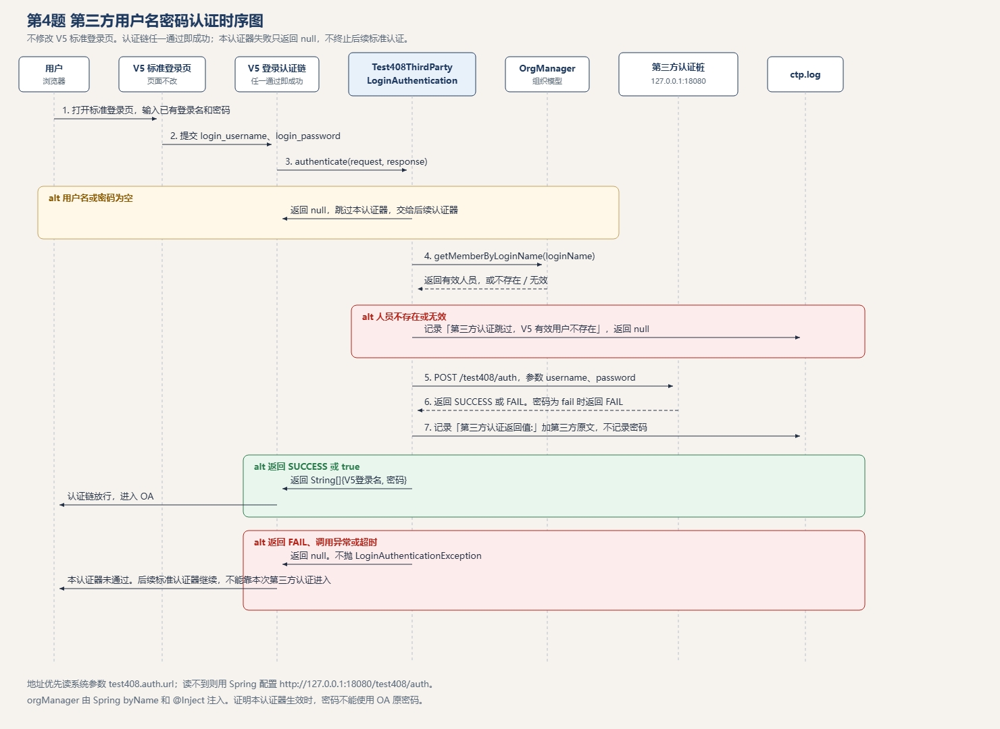

2. 编写认证类，实现对应的基类（LoginAuthentication），实现：

   - 获取用户前端输入的用户名+密码，调用组织模型 API 判断用户是否存在（2 分）
   - 调用第三方接口进行密码校验（2 分）
   - 成功认证登录（2 分）

3. 正确记录日志到ctp.log中（记录第三方接口的返回值）（2 分）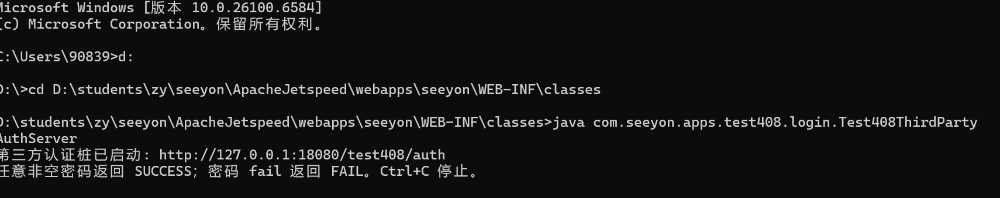

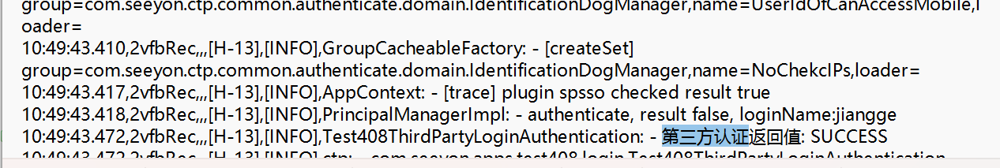

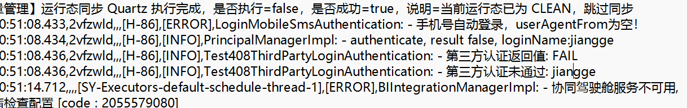